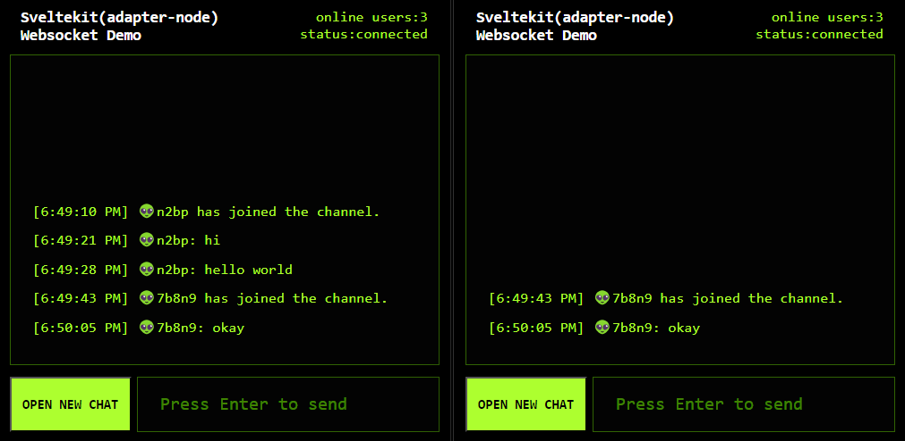

# sk-node-ws-demo

sveltekit + adapter-node + socket.io




 [try it on codesandbox.io](https://codesandbox.io/p/github/aolose/sk-node-ws-demo/main?layout=%257B%2522sidebarPanel%2522%253A%2522EXPLORER%2522%252C%2522rootPanelGroup%2522%253A%257B%2522direction%2522%253A%2522horizontal%2522%252C%2522contentType%2522%253A%2522UNKNOWN%2522%252C%2522type%2522%253A%2522PANEL_GROUP%2522%252C%2522id%2522%253A%2522ROOT_LAYOUT%2522%252C%2522panels%2522%253A%255B%257B%2522type%2522%253A%2522PANEL_GROUP%2522%252C%2522contentType%2522%253A%2522UNKNOWN%2522%252C%2522direction%2522%253A%2522vertical%2522%252C%2522id%2522%253A%2522cluslifz00005356iwpac95tx%2522%252C%2522sizes%2522%253A%255B70%252C30%255D%252C%2522panels%2522%253A%255B%257B%2522type%2522%253A%2522PANEL_GROUP%2522%252C%2522contentType%2522%253A%2522EDITOR%2522%252C%2522direction%2522%253A%2522horizontal%2522%252C%2522id%2522%253A%2522EDITOR%2522%252C%2522panels%2522%253A%255B%257B%2522type%2522%253A%2522PANEL%2522%252C%2522contentType%2522%253A%2522EDITOR%2522%252C%2522id%2522%253A%2522cluslifyz0002356itvy52p3s%2522%257D%255D%257D%252C%257B%2522type%2522%253A%2522PANEL_GROUP%2522%252C%2522contentType%2522%253A%2522SHELLS%2522%252C%2522direction%2522%253A%2522horizontal%2522%252C%2522id%2522%253A%2522SHELLS%2522%252C%2522panels%2522%253A%255B%257B%2522type%2522%253A%2522PANEL%2522%252C%2522contentType%2522%253A%2522SHELLS%2522%252C%2522id%2522%253A%2522cluslifz00003356ist8n0j1x%2522%257D%255D%252C%2522sizes%2522%253A%255B100%255D%257D%255D%257D%252C%257B%2522type%2522%253A%2522PANEL_GROUP%2522%252C%2522contentType%2522%253A%2522DEVTOOLS%2522%252C%2522direction%2522%253A%2522vertical%2522%252C%2522id%2522%253A%2522DEVTOOLS%2522%252C%2522panels%2522%253A%255B%257B%2522type%2522%253A%2522PANEL%2522%252C%2522contentType%2522%253A%2522DEVTOOLS%2522%252C%2522id%2522%253A%2522cluslifz00004356iu58hasic%2522%257D%255D%252C%2522sizes%2522%253A%255B100%255D%257D%255D%252C%2522sizes%2522%253A%255B50%252C50%255D%257D%252C%2522tabbedPanels%2522%253A%257B%2522cluslifyz0002356itvy52p3s%2522%253A%257B%2522tabs%2522%253A%255B%257B%2522id%2522%253A%2522cluslifyz0001356izznausad%2522%252C%2522mode%2522%253A%2522permanent%2522%252C%2522type%2522%253A%2522FILE%2522%252C%2522filepath%2522%253A%2522%252FREADME.md%2522%252C%2522state%2522%253A%2522IDLE%2522%257D%252C%257B%2522id%2522%253A%2522cluslokxd00a9356ihhrbg0rv%2522%252C%2522mode%2522%253A%2522permanent%2522%252C%2522type%2522%253A%2522FILE%2522%252C%2522initialSelections%2522%253A%255B%257B%2522startLineNumber%2522%253A8%252C%2522startColumn%2522%253A3%252C%2522endLineNumber%2522%253A8%252C%2522endColumn%2522%253A3%257D%255D%252C%2522filepath%2522%253A%2522%252Fpackage.json%2522%252C%2522state%2522%253A%2522IDLE%2522%257D%255D%252C%2522id%2522%253A%2522cluslifyz0002356itvy52p3s%2522%252C%2522activeTabId%2522%253A%2522cluslokxd00a9356ihhrbg0rv%2522%257D%252C%2522cluslifz00004356iu58hasic%2522%253A%257B%2522id%2522%253A%2522cluslifz00004356iu58hasic%2522%252C%2522activeTabId%2522%253A%2522clusmjvqf003h356i167gu2kn%2522%252C%2522tabs%2522%253A%255B%257B%2522type%2522%253A%2522TASK_PORT%2522%252C%2522taskId%2522%253A%2522prod%2522%252C%2522port%2522%253A3000%252C%2522id%2522%253A%2522clusmjvqf003h356i167gu2kn%2522%252C%2522mode%2522%253A%2522permanent%2522%252C%2522path%2522%253A%2522%252F%2522%257D%252C%257B%2522type%2522%253A%2522TASK_PORT%2522%252C%2522taskId%2522%253A%2522dev%2522%252C%2522port%2522%253A5173%252C%2522id%2522%253A%2522clusmjxce004j356i5ozqaa61%2522%252C%2522mode%2522%253A%2522permanent%2522%252C%2522path%2522%253A%2522%252F%2522%257D%255D%257D%252C%2522cluslifz00003356ist8n0j1x%2522%253A%257B%2522id%2522%253A%2522cluslifz00003356ist8n0j1x%2522%252C%2522activeTabId%2522%253A%2522clusmjsro001s356iqar1rjuh%2522%252C%2522tabs%2522%253A%255B%257B%2522type%2522%253A%2522TASK_LOG%2522%252C%2522taskId%2522%253A%2522prod%2522%252C%2522id%2522%253A%2522clusmjsro001s356iqar1rjuh%2522%252C%2522mode%2522%253A%2522permanent%2522%257D%252C%257B%2522type%2522%253A%2522TASK_LOG%2522%252C%2522taskId%2522%253A%2522dev%2522%252C%2522id%2522%253A%2522clusmjsro001t356il0v23rgk%2522%252C%2522mode%2522%253A%2522permanent%2522%257D%255D%257D%257D%252C%2522showDevtools%2522%253Atrue%252C%2522showShells%2522%253Atrue%252C%2522showSidebar%2522%253Atrue%252C%2522sidebarPanelSize%2522%253A15%257D)


Very simple to use websockets at server side:

```js
import {useServer} from "vite-sveltekit-node-ws";
import {Server} from 'socket.io'

useServer((server) => {
    const wsServer = new Server(server)
    wsServer.of('hello').on('connect', ws => {
        ws.on('hello', e => {
            ws.emit('echo', `echo: ${e}`)
        })
    })
},(path)=>/socket\.io|hello/.test(path))
```

Client side:

```js
import {io} from "socket.io-client";
import {onMount} from "svelte";

onMount(()=>{
  io(`ws${location.origin.slice(4)}/hello`, {
      reconnectionDelayMax: 10000,
  });
});
```


You only need to configure the vite plugin：

```js
import { sveltekit } from '@sveltejs/kit/vite';
import { defineConfig } from 'vite';
import ws from 'vite-sveltekit-node-ws';

export default defineConfig({
	plugins: [sveltekit(),ws()]
});
```

### vite plugin [vite-sveltekit-node-ws](https://github.com/aolose/vite-sveltekit-node-ws)


### dev
```
pnpm run dev
```


### prev
```
pnpm run prev
```


### prod
```
pnpm run build
pnpm run prod
```
